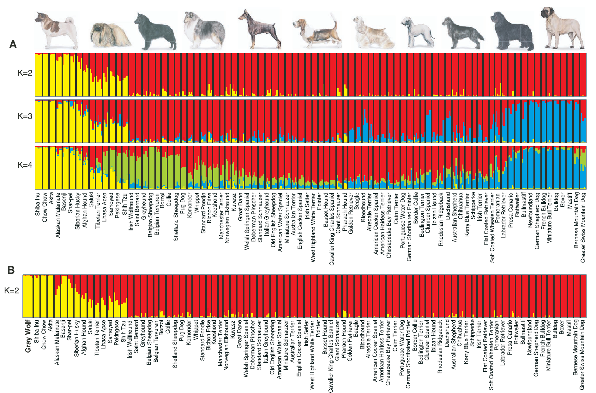
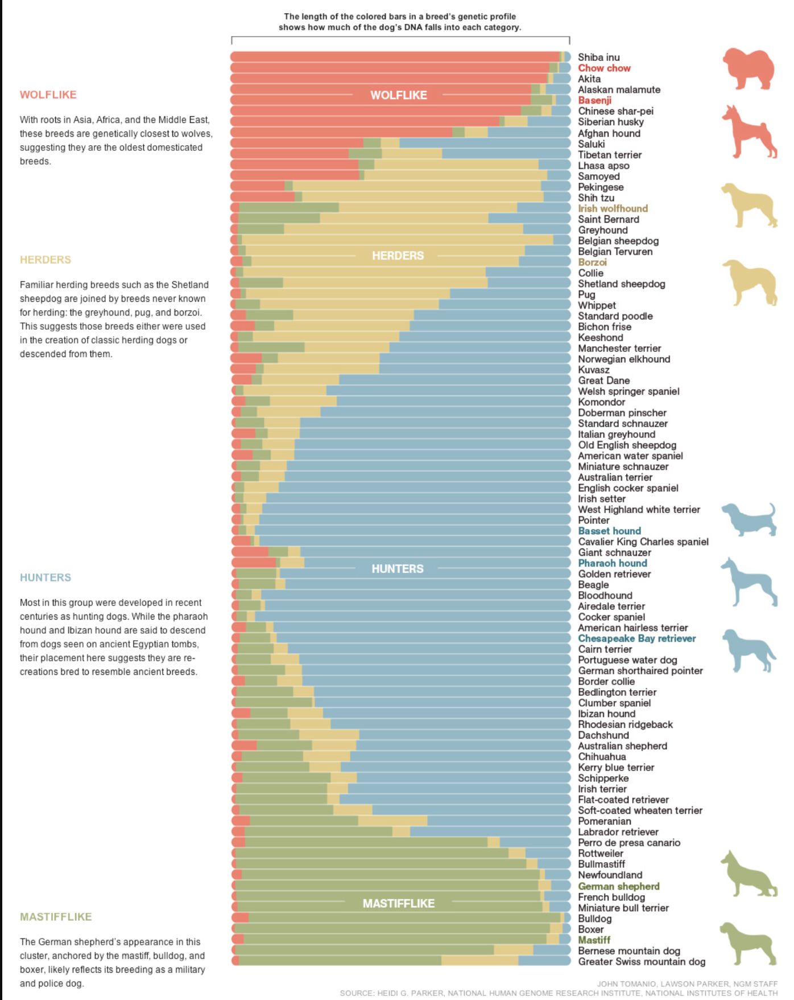

```{r setup, include=FALSE}
knitr::opts_chunk$set(echo = TRUE)
```


# Bad Graph

*Genetic Structure of the Purebred Domestic Dog* (sciencemag.org, 2004) is a journal article about the genetic relationships between dog breeds.   The dataset "genotyped 96 microsatellite loci in 414 purebred dogs representing 85 breeds."  The researchers applied methods of cluster algorithms to the dataset.   They were able to identify four clusters of breeds based on similarities in geographic origin, anatomy, and role in human lives.  The graph compares the 85 breeds based on the outcomes of the clustering.  

I have four primary critiques for this graph.  First, the y-axis label "K=" is unclear without reading the article. K is the number of clusters and each color represents a cluster.  Second, the text gives some description of what the colors mean, but it's never actually defined.  Third, this graphic is difficult to read.  The colors in the bars, the size of the font, and the small vertical words make it difficult to digest.  And lastly, I'm not sure that graph B offers any meaning to the article.





# Good Graph

*How to Build a Dog* was published in February 2012 issue of National Geographic.  This article is a more approachable version of the original 2004 journal artical.  The journalist added history and context to make the research more relevant to the average reader.  Dogs evolved from wolves.  The evolution happened quickly as dogs were bred for specific purposes.  As a result, dogs can be categorized by by less genes than other species. The simplified groups make it easier to study genetics

National Geographic produced their own version of the graph and I find their visual to be much more impactful.  Of the four bar graphs, the magazine selected the one graph with the most meaning and made it more approachable to the average person. I prefer the vertical orientation of this graph and the softer colors.  The clusters are labeled within the graph and there is a legend with definitions for each clusters.  There are instructions on how to interpret the bar and,on the far right, there is clarity about which dogs are being used to represent their cluster. Even though this graph has less information than the original publication, I was able to gain  more knowledge from this graph wihout reading the text.

