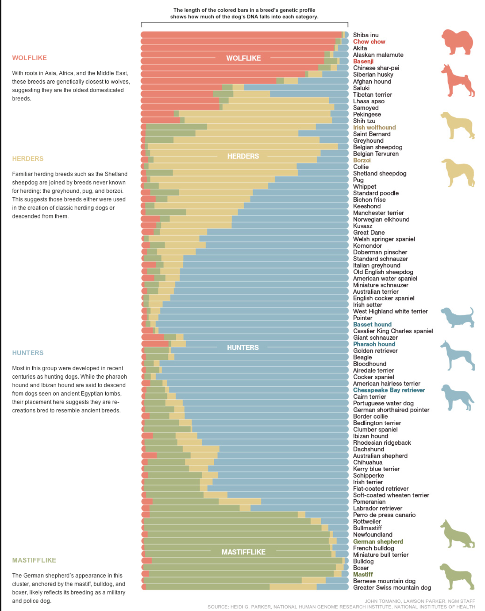

# Bad Graph

This graph is from *Genetic Structure of the Purebred Domestic Dog*
(sciencemag.org, 2004). This article looks at genetic relationships
between dog breeds using various methods of clustering. The dataset
“genotyped 96 microsatellite loci in 414 purebred dogs representing 85
breeds.” The researchers were able to identify four clusters of breeds
based on similarities in geographic origin, anatomy, and role in human
lives. The graph compares the 85 breeds based on the outcomes of the
clustering. K is the number of clusters and each color represents a
cluster.

I have four primary critiques for this graph. First, the label “K=” is
unclear without reading the article. They could have used something more
clear like, “Clustering with two Groups”. Second, the text gives some
description of what the colors mean, but it’s never actually defined. I
have to know that the third cluster is represented by blue, because it’s
the third color that comes into the graphs. And I have to read the text
to know what the third color represents dogs related to the Mastiff.
Third, I think this graphic is difficult to read. The colors in the
bars, the size of the font, and the small vertical words make it
difficult to digest. And lastly, I’m not sure that graph B offers any
meaning to the article.

# Good Graph

In February 2012 the National Geographic included an article that is a
more approachable version of the original 2004 journal artical. They
added context and background to make the research more relevant to the
average reader. Dog evolution happened quickly as they were bred for
specific purposes. As a result, dogs can be categorized by by less genes
than other species.

National Geographic produced their own version of the graph and I find
their visual to be much more impactful. Of the four bar graphs, NatGeo
selected the one graph with the most meaning and made it more
approachable to the average person. I prefer the vertical orientation of
this graph and the softer colors. The clusters are labeled within the
graph and there is a legend with definitions for each clusters. Also,
there are instructions on how to inperpret the bars. And,on the far
right, there is clarity about which dogs are being used to represent
their cluster. Even though this graph has less information than the
original publication, I was able to gain a lot more knowledge from this
graph wihout reading the text.

